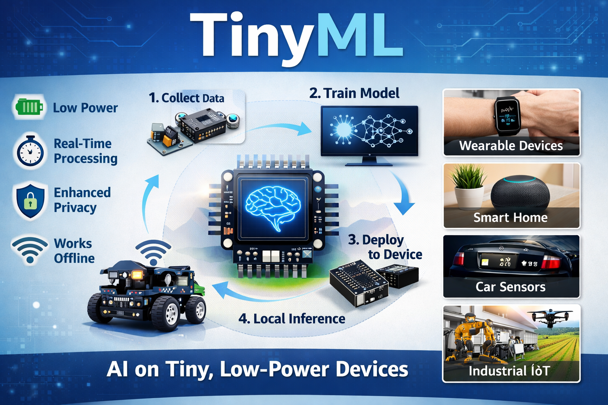

# TinyML Project

## 📌 Overview
TinyML (Tiny Machine Learning) is a technology that enables machine learning models to run on low-power devices such as microcontrollers and embedded systems. It allows real-time data processing without cloud connectivity, making systems faster, more energy-efficient, and secure.

---

## 🚀 Features
- Low power consumption  
- Real-time processing  
- Works without internet connection  
- Enhanced privacy and security  
- Cost-efficient hardware  

---

## 🧠 How TinyML Works
1. Data is collected from sensors.  
2. The machine learning model is trained on a powerful computer.  
3. The model is optimized and compressed.  
4. It is deployed to a microcontroller.  
5. The device makes instant predictions locally.  

---

## 📊 Applications
TinyML is widely used in:

- Wearable health devices  
- Smart home systems  
- Voice assistants  
- Industrial monitoring  
- Agriculture sensors  
- Environmental monitoring  

---

```markdown


